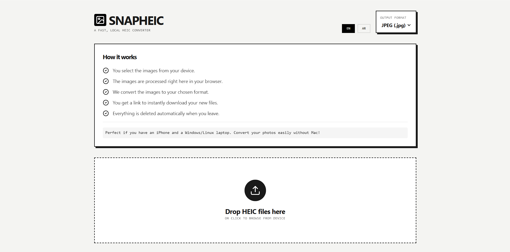
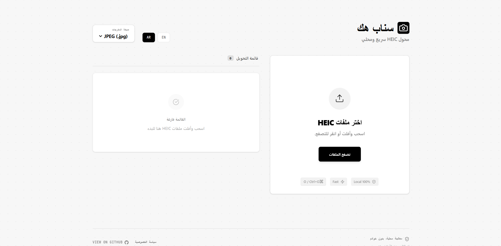
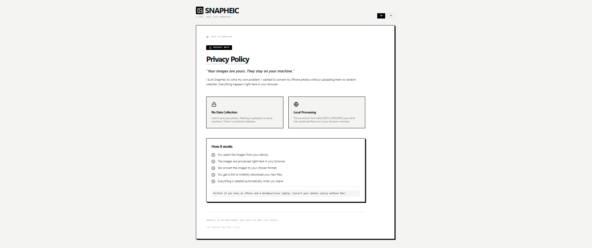

# SnapHEIC — Private iPhone Photo Converter

> *A fast, private, offline-capable HEIC/HEIF converter. No uploads. No servers. Just you and your photos.*



---

I made SnapHEIC because I got tired of the same frustrating dance every time I transferred photos from my iPhone to my Windows laptop. HEIC files everywhere, nothing opens them, and every "free" online converter wants to upload your private photos to some mystery server in exchange. That felt wrong to me.

So I built my own. It's a simple web app that converts HEIC and HEIF images entirely inside your browser — your photos never leave your machine.

---

## What it does

- **Converts HEIC/HEIF → JPEG or PNG** — the two formats that actually work everywhere
- **Runs 100% locally in your browser** — no backend, no server, no cloud
- **Batch processing** — drag and drop a whole folder worth of photos and convert them all at once
- **Individual controls** — convert or download files one at a time if you prefer
- **English + Arabic** — full bilingual support with proper RTL layout for Arabic users
- **Offline-First (PWA)** — Install it as an app and use it without an internet connection
- **50MB per file limit** — keeps your browser happy and prevents memory issues
- **Auto-cleanup** — object URLs are revoked the moment you're done, so nothing lingers

---

## 📱 PWA Support

SnapHeic is a Progressive Web App. This means you can "install" it on your device (Desktop, iOS, or Android) and it will work entirely offline. Since the conversion happens on your local machine, no internet connection is required once the app is loaded.

---

## Screenshots

### Main Converter


The converter lives on a single clean page. You get a "How it works" section up top (because people always wonder what's happening under the hood), then a big drag-and-drop zone below. No clutter, no ads, no popups.

### Arabic / RTL Support



### Privacy Policy



---

## How to run it yourself

If you want to host SnapHEIC locally or deploy your own copy:

**1. Clone the repo**
```bash
git clone https://github.com/kararha/snapH.git
cd snapH
```

**2. Install dependencies**
```bash
npm install
```

**3. Start the dev server**
```bash
npm run dev
```

**To build for production:**
```bash
npm run build
```
The output goes into `dist/` — you can host that folder anywhere.

---

## Project structure

```
snapheic/
├── src/
│   ├── App.tsx                  # Main app — all the converter logic lives here
│   ├── main.tsx                 # React entry point & PWA registration
│   ├── index.css                # Global styles
│   ├── translations.ts          # English and Arabic strings
│   └── components/
│       ├── HowItWorks.tsx       # The "how it works" checklist panel
│       └── PrivacyPolicy.tsx    # The privacy policy view
├── docs/                        
│   ├── DOCUMENTATION.md         # Detailed technical guide
│   ├── STYLE_GUIDE.md           # Visual identity & design system
│   ├── TROUBLESHOOTING.md       # Memory & error help
│   └── screenshot-main.png      # App screenshots
├── index.html                   # Vite HTML entry point (SEO optimized)
├── vite.config.ts               # Vite & PWA configuration
├── CONTRIBUTING.md              # Community contribution guide
├── tsconfig.json                # TypeScript config
└── package.json
```

---

## Tech stack

| Tool | Version | Why |
|---|---|---|
| **React** | 19 | The UI framework. |
| **TypeScript** | ~5.8 | Type safety for conversion logic. |
| **Vite** | 6 | Fast dev server and build tool. |
| **Tailwind CSS** | v4 | Utility-first styling. |
| **heic2any** | 0.0.4 | The core conversion engine. |
| **Vite PWA** | 0.21 | Enables offline installation. |
| **Framer Motion** | 12 | Smooth UI animations. |
| **Lucide React** | 0.546 | Clean, consistent icons. |

---

## Privacy

There is no backend. There is no analytics. There is no tracking pixel. There is no database.

When you close the tab, everything is gone. Your photos stayed on your machine the entire time. If you experience performance issues, please see our [Troubleshooting Guide](./docs/TROUBLESHOOTING.md).

---

## Contributing

We welcome contributions! Please see [CONTRIBUTING.md](./CONTRIBUTING.md) for guidelines on how to help improve SnapHeic. For design consistency, refer to our [Style Guide](./docs/STYLE_GUIDE.md).

---

## License

Apache-2.0 — use it, fork it, improve it.

---

*Built by [Karar Haider](https://github.com/kararha) · [View on GitHub](https://github.com/kararha/snapH)*
